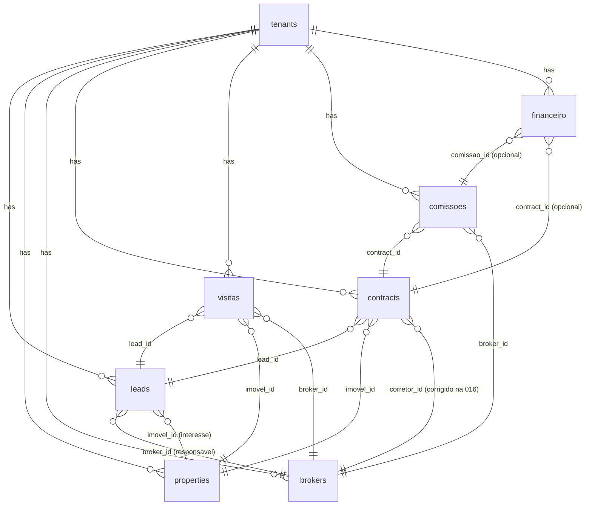

<objective>
Mapear e materializar em SQL o modelo de dados relacional do YZI OS, conectando as 7 entidades do dominio (lead, imovel, corretor, visita, contrato, comissao, financeiro) com Foreign Keys, indices e RLS multi-tenant.

Purpose: Hoje o schema tem entidades isoladas (leads, properties, brokers, contracts) sem o wiring completo que o dominio exige. Leads nao tem FK para brokers/properties, nao existem tabelas de visitas/comissoes/financeiro, e contracts.corretor_id aponta para profiles ao inves de brokers. Sem esse mapeamento, nao conseguimos construir relatorios de pipeline, comissoes por corretor ou fluxo financeiro por tenant.

Output:
1. Migration `016_data_model_relations.sql` idempotente (IF NOT EXISTS, DROP+ADD para FKs) que pode ser aplicada em Supabase producao sem quebrar dados existentes
2. Documento `DATA_MODEL.md` com ERD textual, decisoes de modelagem e query patterns comuns
</objective>

<execution_context>
@$HOME/.claude/get-shit-done/workflows/execute-plan.md
@$HOME/.claude/get-shit-done/templates/summary.md
</execution_context>

<context>
@CLAUDE.md
@.planning/STATE.md
@.claude/skills/yzihub-patterns/SKILL.md

@supabase/migrations/001_initial_schema.sql
@supabase/migrations/008_properties_table.sql
@supabase/migrations/009_properties_extend.sql
@supabase/migrations/010_properties_wordpress_sync.sql
@supabase/migrations/011_contracts_table.sql
@supabase/migrations/012_leads_tenant_phone_unique.sql
@supabase/migrations/013_contracts_add_imovel_conteudo.sql
@supabase/migrations/014_brokers_table.sql
@supabase/migrations/015_brokers_add_is_active.sql
@supabase/migrations/20260409184441_update_contracts_status_constraint.sql

<interfaces>
<!-- Estado atual do schema (extraido das migrations acima) -->

TABELA leads (existente):
```sql
CREATE TABLE leads (
  id              UUID PRIMARY KEY,
  tenant_id       UUID NOT NULL REFERENCES tenants(id),
  stage_id        UUID REFERENCES pipeline_stages(id),
  name            TEXT NOT NULL,
  email           TEXT,
  phone           TEXT,
  status          TEXT CHECK (status IN ('new','contacted','qualified','proposal','negotiation','won','lost')),
  score           INTEGER,
  value           NUMERIC(12,2),
  assigned_to     UUID REFERENCES profiles(id),  -- LEGADO: deveria apontar para brokers
  metadata        JSONB,
  -- sem broker_id, sem imovel_id
);
UNIQUE (tenant_id, phone)  -- migration 012
```

TABELA properties (existente, ja tem tenant_id + todos campos necessarios):
```sql
id, tenant_id, title, price, location, neighborhood, status, property_type, ...
```

TABELA brokers (existente):
```sql
CREATE TABLE brokers (
  id UUID PRIMARY KEY,
  tenant_id UUID NOT NULL REFERENCES tenants(id),
  full_name TEXT NOT NULL,
  phone TEXT, email TEXT, role TEXT, is_active BOOLEAN DEFAULT true,
  created_at, updated_at
);
```

TABELA contracts (existente, mas corretor_id tem FK errada):
```sql
CREATE TABLE contracts (
  id, tenant_id, lead_id REFERENCES leads,
  project_id REFERENCES properties, imovel_id REFERENCES properties,
  corretor_id UUID REFERENCES profiles(id),  -- ERRADO: deveria ser brokers(id)
  status TEXT CHECK (status IN ('draft','sent','signed','cancelled')),  -- migration 20260409184441
  value, file_url, signed_at, expires_at, ...
);
```

FUNCOES AUXILIARES (ja existem, usar em RLS):
- `auth_tenant_id()` — retorna tenant_id do usuario autenticado
- `is_global_admin()` — true se user e admin global (Eric)
- `set_updated_at()` — trigger function para atualizar updated_at

PADRAO RLS (replicar em toda nova tabela):
```sql
ALTER TABLE {nova_tabela} ENABLE ROW LEVEL SECURITY;
CREATE POLICY "{tabela}_select" ON {tabela} FOR SELECT
  USING (is_global_admin() OR tenant_id = auth_tenant_id());
CREATE POLICY "{tabela}_all" ON {tabela} FOR ALL
  USING (is_global_admin() OR tenant_id = auth_tenant_id());
```
</interfaces>
</context>

<tasks>

<task type="auto">
  <name>Task 1: Criar migration 016_data_model_relations.sql</name>
  <files>supabase/migrations/016_data_model_relations.sql</files>
  <action>
Criar migration idempotente (IF NOT EXISTS em todos CREATE, DO blocks para ALTER sensivel) cobrindo:

**PARTE 1 — Estender `leads` com FKs centrais:**
```sql
ALTER TABLE leads
  ADD COLUMN IF NOT EXISTS broker_id UUID REFERENCES brokers(id) ON DELETE SET NULL,
  ADD COLUMN IF NOT EXISTS imovel_id UUID REFERENCES properties(id) ON DELETE SET NULL;

CREATE INDEX IF NOT EXISTS idx_leads_broker_id ON leads(tenant_id, broker_id);
CREATE INDEX IF NOT EXISTS idx_leads_imovel_id ON leads(tenant_id, imovel_id);
```
NAO remover `assigned_to` (legado ainda usado em PipelineDashboardClient.tsx linha 51) — deixar como deprecated, mas documentar em DATA_MODEL.md que `broker_id` e o campo canonico daqui pra frente.

**PARTE 2 — Corrigir `contracts.corretor_id` para apontar para `brokers`:**
Usar DO block para dropar a FK existente (para profiles) e recriar apontando para brokers. Preservar dados NULL, mas warnings se ja houver UUIDs validos apontando para profiles (reset para NULL com WARNING no log).
```sql
DO $$
BEGIN
  -- Drop FK existente (nome auto-gerado)
  IF EXISTS (SELECT 1 FROM pg_constraint
    WHERE conrelid = 'contracts'::regclass AND conname LIKE '%corretor%')
  THEN
    EXECUTE (SELECT 'ALTER TABLE contracts DROP CONSTRAINT ' || quote_ident(conname)
      FROM pg_constraint WHERE conrelid = 'contracts'::regclass AND conname LIKE '%corretor%' LIMIT 1);
  END IF;
END $$;

-- Dados orfaos: setar NULL para corretor_ids que nao existem em brokers
UPDATE contracts SET corretor_id = NULL
WHERE corretor_id IS NOT NULL
  AND corretor_id NOT IN (SELECT id FROM brokers);

ALTER TABLE contracts
  ADD CONSTRAINT contracts_corretor_id_fkey
  FOREIGN KEY (corretor_id) REFERENCES brokers(id) ON DELETE SET NULL;
```

**PARTE 3 — Criar tabela `visitas`:**
```sql
CREATE TABLE IF NOT EXISTS visitas (
  id            UUID PRIMARY KEY DEFAULT uuid_generate_v4(),
  tenant_id     UUID NOT NULL REFERENCES tenants(id) ON DELETE CASCADE,
  lead_id       UUID NOT NULL REFERENCES leads(id) ON DELETE CASCADE,
  imovel_id     UUID NOT NULL REFERENCES properties(id) ON DELETE CASCADE,
  broker_id     UUID REFERENCES brokers(id) ON DELETE SET NULL,
  scheduled_at  TIMESTAMPTZ NOT NULL,
  completed_at  TIMESTAMPTZ,
  status        TEXT NOT NULL DEFAULT 'scheduled'
                  CHECK (status IN ('scheduled','completed','cancelled','no_show')),
  notes         TEXT,
  created_at    TIMESTAMPTZ NOT NULL DEFAULT NOW(),
  updated_at    TIMESTAMPTZ NOT NULL DEFAULT NOW()
);
CREATE INDEX IF NOT EXISTS idx_visitas_tenant_id    ON visitas(tenant_id);
CREATE INDEX IF NOT EXISTS idx_visitas_lead_id      ON visitas(tenant_id, lead_id);
CREATE INDEX IF NOT EXISTS idx_visitas_imovel_id    ON visitas(tenant_id, imovel_id);
CREATE INDEX IF NOT EXISTS idx_visitas_broker_id    ON visitas(tenant_id, broker_id);
CREATE INDEX IF NOT EXISTS idx_visitas_scheduled_at ON visitas(tenant_id, scheduled_at DESC);
```

**PARTE 4 — Criar tabela `comissoes`:**
```sql
CREATE TABLE IF NOT EXISTS comissoes (
  id            UUID PRIMARY KEY DEFAULT uuid_generate_v4(),
  tenant_id     UUID NOT NULL REFERENCES tenants(id) ON DELETE CASCADE,
  contract_id   UUID NOT NULL REFERENCES contracts(id) ON DELETE CASCADE,
  broker_id     UUID NOT NULL REFERENCES brokers(id) ON DELETE RESTRICT,
  percentual    NUMERIC(5,2) NOT NULL CHECK (percentual >= 0 AND percentual <= 100),
  valor         NUMERIC(14,2) NOT NULL CHECK (valor >= 0),
  status        TEXT NOT NULL DEFAULT 'pending'
                  CHECK (status IN ('pending','approved','paid','cancelled')),
  paid_at       TIMESTAMPTZ,
  notes         TEXT,
  created_at    TIMESTAMPTZ NOT NULL DEFAULT NOW(),
  updated_at    TIMESTAMPTZ NOT NULL DEFAULT NOW()
);
CREATE INDEX IF NOT EXISTS idx_comissoes_tenant_id   ON comissoes(tenant_id);
CREATE INDEX IF NOT EXISTS idx_comissoes_contract_id ON comissoes(tenant_id, contract_id);
CREATE INDEX IF NOT EXISTS idx_comissoes_broker_id   ON comissoes(tenant_id, broker_id);
CREATE INDEX IF NOT EXISTS idx_comissoes_status      ON comissoes(tenant_id, status);
```

**PARTE 5 — Criar tabela `financeiro`:**
```sql
CREATE TABLE IF NOT EXISTS financeiro (
  id            UUID PRIMARY KEY DEFAULT uuid_generate_v4(),
  tenant_id     UUID NOT NULL REFERENCES tenants(id) ON DELETE CASCADE,
  comissao_id   UUID REFERENCES comissoes(id) ON DELETE SET NULL,
  contract_id   UUID REFERENCES contracts(id) ON DELETE SET NULL,
  tipo          TEXT NOT NULL CHECK (tipo IN ('entrada','saida')),
  categoria     TEXT NOT NULL,  -- ex: 'comissao','aluguel','marketing','salario','outros'
  descricao     TEXT NOT NULL,
  valor         NUMERIC(14,2) NOT NULL CHECK (valor >= 0),
  data_evento   DATE NOT NULL,
  status        TEXT NOT NULL DEFAULT 'confirmado'
                  CHECK (status IN ('previsto','confirmado','cancelado')),
  metadata      JSONB NOT NULL DEFAULT '{}',
  created_at    TIMESTAMPTZ NOT NULL DEFAULT NOW(),
  updated_at    TIMESTAMPTZ NOT NULL DEFAULT NOW()
);
CREATE INDEX IF NOT EXISTS idx_financeiro_tenant_id   ON financeiro(tenant_id);
CREATE INDEX IF NOT EXISTS idx_financeiro_data_evento ON financeiro(tenant_id, data_evento DESC);
CREATE INDEX IF NOT EXISTS idx_financeiro_tipo        ON financeiro(tenant_id, tipo, status);
```

**PARTE 6 — Triggers updated_at + RLS para as tres novas tabelas:**
```sql
CREATE TRIGGER trg_visitas_updated_at     BEFORE UPDATE ON visitas     FOR EACH ROW EXECUTE FUNCTION set_updated_at();
CREATE TRIGGER trg_comissoes_updated_at   BEFORE UPDATE ON comissoes   FOR EACH ROW EXECUTE FUNCTION set_updated_at();
CREATE TRIGGER trg_financeiro_updated_at  BEFORE UPDATE ON financeiro  FOR EACH ROW EXECUTE FUNCTION set_updated_at();

ALTER TABLE visitas    ENABLE ROW LEVEL SECURITY;
ALTER TABLE comissoes  ENABLE ROW LEVEL SECURITY;
ALTER TABLE financeiro ENABLE ROW LEVEL SECURITY;

-- Replicar padrao das outras tabelas (ver interfaces acima): select + all
CREATE POLICY "visitas_select"    ON visitas    FOR SELECT USING (is_global_admin() OR tenant_id = auth_tenant_id());
CREATE POLICY "visitas_all"       ON visitas    FOR ALL    USING (is_global_admin() OR tenant_id = auth_tenant_id());
CREATE POLICY "comissoes_select"  ON comissoes  FOR SELECT USING (is_global_admin() OR tenant_id = auth_tenant_id());
CREATE POLICY "comissoes_all"     ON comissoes  FOR ALL    USING (is_global_admin() OR tenant_id = auth_tenant_id());
CREATE POLICY "financeiro_select" ON financeiro FOR SELECT USING (is_global_admin() OR tenant_id = auth_tenant_id());
CREATE POLICY "financeiro_all"    ON financeiro FOR ALL    USING (is_global_admin() OR tenant_id = auth_tenant_id());
```

**REGRAS DE OURO (DO NOT VIOLATE):**
- TODA FK cross-tenant e invalida. Todas as FKs apontam para tabelas que ja tem tenant_id, mas nao existe constraint "mesmo tenant_id" no SQL — isso e garantido pela RLS. NAO tente adicionar CHECK constraints que fazem SELECT, pois Postgres proibe.
- NAO usar CASCADE em broker_id de comissoes (RESTRICT) — nao queremos perder historico de comissao se broker for deletado.
- Todas operacoes devem ser idempotentes: rodar a migration duas vezes nao deve quebrar.
- NAO renomear ou dropar colunas existentes (assigned_to em leads fica como esta).

Ao final do arquivo, adicionar comentario `-- END migration 016` para marcar conclusao.
  </action>
  <verify>
    <automated>
# Checar sintaxe SQL basica (parsing) — nao aplica no banco
node -e "const fs=require('fs');const sql=fs.readFileSync('supabase/migrations/016_data_model_relations.sql','utf8');
const req=['CREATE TABLE IF NOT EXISTS visitas','CREATE TABLE IF NOT EXISTS comissoes','CREATE TABLE IF NOT EXISTS financeiro','ADD COLUMN IF NOT EXISTS broker_id','ADD COLUMN IF NOT EXISTS imovel_id','REFERENCES brokers(id)','ENABLE ROW LEVEL SECURITY','auth_tenant_id()'];
const miss=req.filter(r=>!sql.includes(r));
if(miss.length){console.error('MISSING:',miss);process.exit(1)}
console.log('OK — migration tem todos elementos obrigatorios')"
    </automated>
  </verify>
  <done>
- Arquivo `supabase/migrations/016_data_model_relations.sql` existe
- Contem ALTER TABLE leads com broker_id + imovel_id
- Contem CREATE TABLE visitas, comissoes, financeiro (todas com tenant_id NOT NULL + FK)
- Contem ajuste de contracts.corretor_id apontando para brokers
- Contem RLS ativado nas 3 novas tabelas com policies select + all
- Todas as operacoes sao idempotentes (IF NOT EXISTS, DO blocks)
- Pelo menos 10 indices criados (2 em leads + 5 visitas + 4 comissoes + 3 financeiro)
  </done>
</task>

<task type="auto">
  <name>Task 2: Documentar modelo em DATA_MODEL.md</name>
  <files>.planning/quick/260417-scq-mapear-modelo-de-dados-yzi-os-rela-es-en/DATA_MODEL.md</files>
  <action>
Criar documento `DATA_MODEL.md` no diretorio do quick com as secoes:

**1. Visao Geral (5-10 linhas)**
- Lead e a entidade central do YZI OS
- Multi-tenant: toda tabela tem tenant_id + RLS
- 7 entidades: lead, imovel (properties), corretor (brokers), visita, contrato, comissao, financeiro

**2. ERD Textual (ASCII ou mermaid)**
Usar blocos fenced para mermaid:


**3. Detalhamento das FKs por Entidade**
Para cada tabela listar: colunas-chave, FKs, indices, delete behavior. Exemplo:
```
### leads
- PK: id (UUID)
- tenant_id → tenants (CASCADE)
- broker_id → brokers (SET NULL) — NOVO na 016
- imovel_id → properties (SET NULL) — NOVO na 016
- stage_id → pipeline_stages (SET NULL)
- assigned_to → profiles (SET NULL) — LEGADO, substituido por broker_id
- UNIQUE (tenant_id, phone)
```

**4. Query Patterns Comuns + Indice Responsavel**
Listar 5-8 queries que a aplicacao vai fazer e qual indice cobre:
- "Leads de um corretor no tenant X" → `idx_leads_broker_id (tenant_id, broker_id)`
- "Visitas agendadas da semana" → `idx_visitas_scheduled_at (tenant_id, scheduled_at DESC)`
- "Comissoes pendentes de pagamento" → `idx_comissoes_status (tenant_id, status)`
- "Fluxo de caixa do mes" → `idx_financeiro_data_evento (tenant_id, data_evento DESC)`
- "Contratos de um corretor" → usar `idx_contracts_tenant_id` + filtro por corretor_id
- Etc.

**5. Decisoes de Modelagem**
Lista numerada com justificativa:
1. **`assigned_to` mantido como legado** — PipelineDashboardClient.tsx ja usa; migrar codigo gradualmente para `broker_id` (criar issue separada)
2. **`contracts.corretor_id` migrado de profiles para brokers** — profiles sao usuarios do sistema, brokers sao corretores vinculados ao tenant (pode existir sem conta de login)
3. **`comissoes.broker_id` com ON DELETE RESTRICT** — nao perder historico se corretor for removido (forcar arquivamento antes)
4. **`financeiro` generico** — tipo+categoria flexivel, linkavel a comissao/contrato opcionalmente, permite registrar despesas que nao tem contraparte (aluguel, marketing)
5. **Sem constraint cross-tenant em SQL** — garantido por RLS + aplicacao; Postgres nao suporta CHECK com subquery
6. **Indices compostos sempre iniciam com tenant_id** — RLS sempre filtra por ele, maximiza uso do indice

**6. Proximos Passos (Backlog)**
- Criar API routes /api/visitas, /api/comissoes, /api/financeiro seguindo padrao de /api/brokers
- Migrar codigo de `lead.assigned_to` para `lead.broker_id`
- Criar UI de agendamento de visitas (card no LeadDrawer)
- Criar dashboard de comissoes por corretor (extensao de /cockpit/corretores)

**7. Como Aplicar a Migration**
Instrucao curta:
```bash
# Via Supabase CLI
supabase db push

# Ou via SQL Editor do dashboard Supabase
# Copiar conteudo de supabase/migrations/016_data_model_relations.sql
```

Minimo 80 linhas no total.
  </action>
  <verify>
    <automated>
node -e "const fs=require('fs');const doc=fs.readFileSync('.planning/quick/260417-scq-mapear-modelo-de-dados-yzi-os-rela-es-en/DATA_MODEL.md','utf8');
const lines=doc.split('\n').length;
const req=['mermaid','leads','visitas','comissoes','financeiro','broker_id','imovel_id','Query Patterns','Decisoes'];
const miss=req.filter(r=>!doc.includes(r));
if(miss.length){console.error('MISSING sections:',miss);process.exit(1)}
if(lines<80){console.error('TOO SHORT:',lines,'lines (min 80)');process.exit(1)}
console.log('OK — DATA_MODEL.md tem',lines,'linhas e todas as secoes')"
    </automated>
  </verify>
  <done>
- Arquivo `.planning/quick/260417-scq-.../DATA_MODEL.md` existe (min 80 linhas)
- Contem diagrama ERD mermaid com todas 7 entidades + tenants
- Detalha FKs de cada tabela
- Lista 5+ query patterns com indices associados
- Lista 6 decisoes de modelagem com justificativa
- Lista proximos passos (backlog de trabalho futuro)
- Instrucao de como aplicar a migration
  </done>
</task>

</tasks>

<verification>
- [ ] `supabase/migrations/016_data_model_relations.sql` cria visitas, comissoes, financeiro com tenant_id NOT NULL
- [ ] leads ganhou broker_id + imovel_id (FK SET NULL)
- [ ] contracts.corretor_id agora referencia brokers(id), nao profiles
- [ ] Todas 3 novas tabelas tem RLS + policies select/all
- [ ] Todas 3 novas tabelas tem trigger updated_at
- [ ] Pelo menos 14 indices criados (2 leads + 5 visitas + 4 comissoes + 3 financeiro)
- [ ] Migration e idempotente (roda duas vezes sem erro)
- [ ] DATA_MODEL.md documenta ERD + FKs + query patterns + decisoes
- [ ] Checagem de sintaxe SQL via grep de keywords passa
</verification>

<success_criteria>
A plataforma tem agora um modelo de dados completo e rastreavel:
1. **Lead central**: pode ser linkado a um corretor responsavel (broker_id) e um imovel de interesse (imovel_id)
2. **Visitas**: evento 3-way (lead + imovel + broker) com agendamento e status
3. **Comissoes**: vinculadas a contratos e corretores com percentual e valor
4. **Financeiro**: registra entradas e saidas por tenant, com link opcional para comissao/contrato
5. **Contratos**: corrigidos para apontar para brokers (nao profiles)
6. **Multi-tenant**: todas tabelas com tenant_id + RLS + indices cobrindo queries comuns
7. **Documentado**: DATA_MODEL.md com ERD, query patterns e decisoes de modelagem

A migration pode ser aplicada em producao com `supabase db push` sem quebrar dados existentes.
</success_criteria>

<output>
After completion, create `.planning/quick/260417-scq-mapear-modelo-de-dados-yzi-os-rela-es-en/260417-scq-SUMMARY.md` seguindo o template padrao do get-shit-done.
</output>
