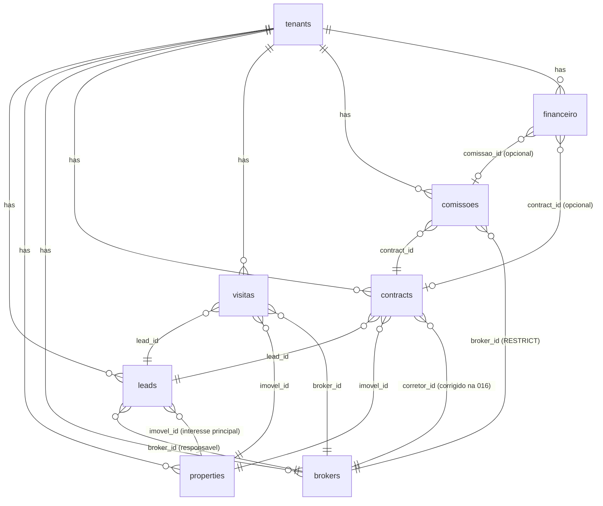

# DATA MODEL — YZI OS
> Modelo relacional completo do dominio YZI OS.
> Gerado por migration 016_data_model_relations.sql (2026-04-17)

---

## 1. Visao Geral

Lead e a entidade central do YZI OS. Todo o fluxo comercial — desde o primeiro contato no WhatsApp ate o contrato assinado e a comissao paga — passa pelo lead.

A plataforma e multi-tenant: **toda tabela tem `tenant_id`** com FK para `tenants` e RLS ativo, garantindo isolamento total entre clientes.

**7 entidades do dominio:**

| Entidade     | Tabela SQL   | Descricao                                                  |
|--------------|--------------|------------------------------------------------------------|
| Lead         | `leads`      | Contato captado pelo agente IA ou manualmente              |
| Imovel       | `properties` | Produto imobiliario disponivel no tenant                   |
| Corretor     | `brokers`    | Profissional vinculado ao tenant (sem conta de login obrig)|
| Visita       | `visitas`    | Agendamento 3-way: lead + imovel + corretor                |
| Contrato     | `contracts`  | Instrumento juridico do negocio                            |
| Comissao     | `comissoes`  | Remuneracao do corretor por contrato fechado               |
| Financeiro   | `financeiro` | Fluxo de caixa: entradas e saidas do tenant                |

---

## 2. ERD Textual (Mermaid)



---

## 3. Detalhamento das FKs por Entidade

### leads
- PK: `id` (UUID)
- `tenant_id` → `tenants(id)` ON DELETE CASCADE
- `broker_id` → `brokers(id)` ON DELETE SET NULL — **NOVO na 016** (corretor responsavel)
- `imovel_id` → `properties(id)` ON DELETE SET NULL — **NOVO na 016** (imovel de interesse principal)
- `stage_id` → `pipeline_stages(id)` ON DELETE SET NULL
- `assigned_to` → `profiles(id)` ON DELETE SET NULL — **LEGADO**, substituido por `broker_id`
- UNIQUE `(tenant_id, phone)` — migration 012
- Indices: `idx_leads_broker_id (tenant_id, broker_id)`, `idx_leads_imovel_id (tenant_id, imovel_id)`

### properties
- PK: `id` (UUID)
- `tenant_id` → `tenants(id)` ON DELETE CASCADE
- Campos: `title`, `price`, `location`, `neighborhood`, `status`, `property_type`, `bedrooms`, `bathrooms`, `area_m2`, `parking_spots`, `description`, metadados WordPress
- Indice: `idx_properties_tenant_id`

### brokers
- PK: `id` (UUID)
- `tenant_id` → `tenants(id)` ON DELETE CASCADE
- Campos: `full_name`, `phone`, `email`, `role`, `is_active` (migration 015)
- Indice: `idx_brokers_tenant_id`

### visitas
- PK: `id` (UUID)
- `tenant_id` → `tenants(id)` ON DELETE CASCADE
- `lead_id` → `leads(id)` ON DELETE CASCADE — obrigatorio
- `imovel_id` → `properties(id)` ON DELETE CASCADE — obrigatorio
- `broker_id` → `brokers(id)` ON DELETE SET NULL — opcional
- `scheduled_at` TIMESTAMPTZ NOT NULL
- `status` CHECK ('scheduled', 'completed', 'cancelled', 'no_show')
- Indices: `idx_visitas_tenant_id`, `idx_visitas_lead_id`, `idx_visitas_imovel_id`, `idx_visitas_broker_id`, `idx_visitas_scheduled_at`

### contracts
- PK: `id` (UUID)
- `tenant_id` → `tenants(id)` ON DELETE CASCADE
- `lead_id` → `leads(id)` ON DELETE SET NULL
- `project_id` → `properties(id)` ON DELETE SET NULL
- `imovel_id` → `properties(id)` ON DELETE SET NULL
- `corretor_id` → `brokers(id)` ON DELETE SET NULL — **CORRIGIDO na 016** (era profiles)
- `status` CHECK ('draft', 'sent', 'signed', 'cancelled') — migration 20260409184441
- Indices: `idx_contracts_tenant_id`, `idx_contracts_lead_id`, `idx_contracts_status`

### comissoes
- PK: `id` (UUID)
- `tenant_id` → `tenants(id)` ON DELETE CASCADE
- `contract_id` → `contracts(id)` ON DELETE CASCADE — obrigatorio
- `broker_id` → `brokers(id)` ON DELETE **RESTRICT** — historico preservado
- `percentual` NUMERIC(5,2) CHECK (0-100)
- `valor` NUMERIC(14,2) CHECK (>= 0)
- `status` CHECK ('pending', 'approved', 'paid', 'cancelled')
- Indices: `idx_comissoes_tenant_id`, `idx_comissoes_contract_id`, `idx_comissoes_broker_id`, `idx_comissoes_status`

### financeiro
- PK: `id` (UUID)
- `tenant_id` → `tenants(id)` ON DELETE CASCADE
- `comissao_id` → `comissoes(id)` ON DELETE SET NULL — opcional
- `contract_id` → `contracts(id)` ON DELETE SET NULL — opcional
- `tipo` CHECK ('entrada', 'saida')
- `categoria` TEXT (ex: 'comissao', 'aluguel', 'marketing', 'salario', 'outros')
- `data_evento` DATE NOT NULL
- `status` CHECK ('previsto', 'confirmado', 'cancelado')
- `metadata` JSONB NOT NULL DEFAULT '{}'
- Indices: `idx_financeiro_tenant_id`, `idx_financeiro_data_evento`, `idx_financeiro_tipo`

---

## 4. Query Patterns Comuns + Indice Responsavel

| Query                                              | Indice Responsavel                                  |
|----------------------------------------------------|-----------------------------------------------------|
| Leads de um corretor no tenant X                   | `idx_leads_broker_id (tenant_id, broker_id)`        |
| Leads com imovel de interesse especifico           | `idx_leads_imovel_id (tenant_id, imovel_id)`        |
| Visitas agendadas da semana                        | `idx_visitas_scheduled_at (tenant_id, scheduled_at DESC)` |
| Todas visitas de um lead                           | `idx_visitas_lead_id (tenant_id, lead_id)`          |
| Corretores com visitas pendentes                   | `idx_visitas_broker_id (tenant_id, broker_id)`      |
| Comissoes pendentes de pagamento                   | `idx_comissoes_status (tenant_id, status)`          |
| Comissoes de um contrato especifico                | `idx_comissoes_contract_id (tenant_id, contract_id)`|
| Comissoes de um corretor (historico)               | `idx_comissoes_broker_id (tenant_id, broker_id)`    |
| Fluxo de caixa do mes                              | `idx_financeiro_data_evento (tenant_id, data_evento DESC)` |
| Receitas vs despesas por categoria                 | `idx_financeiro_tipo (tenant_id, tipo, status)`     |
| Contratos de um corretor                           | `idx_contracts_status + filtro corretor_id`         |

---

## 5. Decisoes de Modelagem

1. **`assigned_to` mantido como legado** — `PipelineDashboardClient.tsx` linha 51 ja usa esse campo com JOIN para profiles. Migrar codigo gradualmente para `broker_id` em issue separada. Ambos coexistem sem conflito.

2. **`contracts.corretor_id` migrado de `profiles` para `brokers`** — profiles sao usuarios do sistema (login obrigatorio), brokers sao profissionais vinculados ao tenant que podem existir sem conta de login. O dominio comercial imobiliario exige esse desacoplamento.

3. **`comissoes.broker_id` com ON DELETE RESTRICT** — historico financeiro nao pode ser perdido se um corretor for desligado do tenant. O fluxo correto e: arquivar corretor (`is_active = false`) antes de excluir. Se houver comissoes, a exclusao e bloqueada pelo banco.

4. **`financeiro` generico e flexivel** — `tipo + categoria` permitem registrar qualquer entrada ou saida sem criar tabelas especializadas. O link para `comissao_id` e `contract_id` e opcional, permitindo despesas sem contraparte (ex: aluguel do escritorio, marketing).

5. **Sem constraint cross-tenant em SQL** — RLS garante isolamento por tenant na aplicacao. Postgres nao suporta CHECK constraints com subquery correlacionada. A responsabilidade de garantir que `broker_id` e `lead_id` pertencam ao mesmo tenant e da camada de aplicacao (API routes) e do RLS.

6. **Indices compostos sempre iniciam com `tenant_id`** — O predicado de RLS (`tenant_id = auth_tenant_id()`) e sempre aplicado primeiro. Indices compostos `(tenant_id, X)` sao usados em quase toda query, maximizando o uso do indice e evitando seq scans.

7. **`OR CREATE REPLACE TRIGGER` para updated_at** — Triggers sao criados com `CREATE OR REPLACE` para suportar re-execucao da migration sem erro de duplicidade.

---

## 6. Proximos Passos (Backlog)

- [ ] Criar API routes `/api/visitas`, `/api/comissoes`, `/api/financeiro` seguindo padrao de `/api/brokers`
- [ ] Migrar referencias de `lead.assigned_to` para `lead.broker_id` em `PipelineDashboardClient.tsx` e componentes relacionados
- [ ] Criar UI de agendamento de visitas (card no `LeadDrawer`, aba "Visitas")
- [ ] Criar dashboard de comissoes por corretor (extensao de `/cockpit/corretores`)
- [ ] Criar modulo de fluxo de caixa em `/cockpit/financeiro` usando tabela `financeiro`
- [ ] Remover coluna `assigned_to` apos migracao completa (em versao futura, nao urgente)
- [ ] Adicionar indice em `contracts(tenant_id, corretor_id)` quando query de contratos por corretor for implementada

---

## 7. Como Aplicar a Migration

```bash
# Via Supabase CLI (recomendado para producao)
supabase db push

# Ou via SQL Editor do dashboard Supabase
# Copiar conteudo de: supabase/migrations/016_data_model_relations.sql
# Colar no SQL Editor e executar
```

**A migration e idempotente:** pode ser executada multiplas vezes sem erros (`IF NOT EXISTS`, `DO blocks` para FKs existentes, `ON CONFLICT DO NOTHING`).

**Pre-requisito:** migrations 001-015 devem estar aplicadas (especialmente 014 para `brokers` e 011 para `contracts`).
